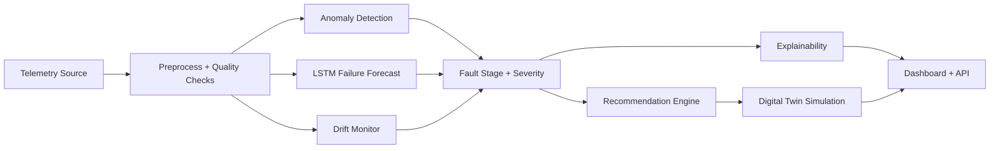

# SpaceOps AI

SpaceOps AI is a satellite health intelligence platform built to solve a real operations problem: how to detect faults early from telemetry, estimate failure progression, explain why risk is increasing, and recommend corrective action before a mission-impacting event occurs.

It combines anomaly detection, Remaining Useful Life forecasting, explainable AI, digital twin simulation, drift monitoring, live orbit-aware context, and a mission-control dashboard in one deployable project.

## Why this project stands out

- Multistage AI pipeline instead of a single prediction model
- Explainable fault analysis, not just raw risk scores
- Digital twin simulation to test actions before execution
- Dashboard plus API plus Docker packaging
- Live orbit-derived telemetry and space weather context
- Strong engineering layer with tests, reports, monitoring, and reusable inference code

## Screenshots

### Dashboard Overview


### API and Inference Flow


### System Architecture


## Core problem solved

Satellite telemetry is high-volume and hard to interpret in real time. Operators need help answering five questions quickly:

1. Is the system behaving abnormally?
2. How close is it to failure?
3. What is likely causing the problem?
4. What should be done now?
5. What will happen if that action is taken?

SpaceOps AI answers all five through a single mission-ops workflow.

## Key features

- Data pipeline using NASA CMAPSS as a proxy for spacecraft telemetry
- Anomaly detection using a PyTorch autoencoder with Isolation Forest fallback
- LSTM-based Remaining Useful Life prediction
- Fault class and severity staging
- Explainability layer with top driver analysis
- Rule-based self-healing recommendation engine
- Digital twin action simulation
- Scenario engine for solar storm, thermal spike, battery drain, and comms noise
- Drift monitoring and persistent alert history
- Live orbit tracking and space weather overlay
- Streamlit mission-control dashboard
- FastAPI inference and simulation API
- Authenticated API mode, request tracing, manifest reporting, and audit logging
- Docker packaging for deployment

## Repository structure

```text
spaceops_ai/
├── app.py
├── api.py
├── preprocess.py
├── train_anomaly.py
├── train_lstm.py
├── recommendation_engine.py
├── config.py
├── Dockerfile
├── requirements.txt
├── assets/
│   └── screenshots/
├── docs/
│   ├── ARCHITECTURE.md
│   └── PORTFOLIO.md
├── tests/
├── utils/
├── data/
│   ├── raw/
│   └── processed/
└── models/
```

## Architecture



More detail: [ARCHITECTURE.md](/Users/manikx22/Documents/SpaceAI/spaceops_ai/docs/ARCHITECTURE.md)

## Quick start

Install dependencies:

```bash
pip install -r requirements.txt
```

Train models:

```bash
python preprocess.py
python train_anomaly.py
python train_lstm.py
```

Launch dashboard:

```bash
streamlit run app.py --server.address 127.0.0.1 --server.port 8501
```

Launch API:

```bash
uvicorn api:app --host 0.0.0.0 --port 8000
```

Optional authenticated API mode:

```bash
export SPACEOPS_API_KEY="replace-with-your-token"
uvicorn api:app --host 0.0.0.0 --port 8000
```

Run tests:

```bash
pytest -q
```

## API

- `GET /health`
- `GET /health/live`
- `GET /health/ready`
- `GET /manifest`
- `GET /audit/recent`
- `POST /predict`
- `POST /simulate`

The API returns health state, failure risk, RUL, recommendation, explainability details, and digital twin comparison.
When `SPACEOPS_API_KEY` is set, `/manifest`, `/audit/recent`, `/predict`, and `/simulate` require the `X-API-Key` header.

## Data sources

- NASA CMAPSS turbofan dataset used as a structured proxy for satellite telemetry
- Live ISS orbit position feed for real-time orbit-aware telemetry derivation
- NOAA space weather feed with local cache fallback

If CMAPSS is not available locally, the project automatically generates synthetic telemetry so the platform remains runnable.

## Evaluation and reports

The platform stores runtime and training evidence in `data/processed/`, including:

- data quality report
- anomaly model training report
- LSTM validation report
- model manifest
- API audit log
- alert history
- live telemetry cache
- space weather cache

## Deployment

Build Docker image:

```bash
docker build -t spaceops-ai .
```

Run dashboard container:

```bash
docker run -p 8501:8501 spaceops-ai
```

Run API container:

```bash
docker run -p 8000:8000 --entrypoint uvicorn spaceops-ai api:app --host 0.0.0.0 --port 8000
```

## Portfolio use

Portfolio positioning notes and resume bullets are in [PORTFOLIO.md](/Users/manikx22/Documents/SpaceAI/spaceops_ai/docs/PORTFOLIO.md).

Short version:

- Built an AI-driven satellite health intelligence platform for telemetry anomaly detection, failure forecasting, explainable fault analysis, autonomous recommendation generation, and digital twin action simulation.
- Delivered both a mission-control dashboard and an API service using PyTorch, Streamlit, FastAPI, and Docker.

## Limitations

- CMAPSS is a proxy dataset, not true spacecraft bus telemetry
- Live telemetry is orbit-derived, not a complete real satellite subsystem stream
- Recommendation logic is rule-based, not learned from historical operator action data
- This is production-oriented software engineering, not a flight-certified aerospace control stack

## Future direction

- Real satellite bus telemetry ingestion
- Learned fault classification with labeled mission incidents
- Reinforcement learning for autonomous recovery strategy
- Multi-satellite fleet orchestration
