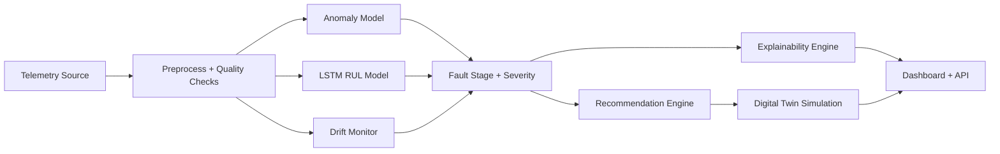

# SpaceOps AI

SpaceOps AI is an end-to-end satellite health intelligence platform that predicts faults from telemetry time-series data, explains why risk is rising, simulates corrective actions, and recommends self-healing responses through an operations dashboard and API.

## Core Problem

Satellites generate continuous telemetry, but mission teams need more than raw charts. The core problem solved here is:

- detect abnormal behavior early from telemetry sequences
- estimate how close the system is to failure
- explain the likely cause
- recommend a corrective action
- simulate the likely mission impact of that action

The project uses NASA CMAPSS turbofan data as a proxy for satellite subsystem telemetry, with live orbit-derived telemetry and space weather overlays for mission-style monitoring.

Core capabilities:
- Data pipeline: load, normalize, label RUL, generate LSTM windows
- Anomaly detection: PyTorch autoencoder with IsolationForest fallback
- Failure prediction: PyTorch LSTM for Remaining Useful Life (RUL)
- Recommendation engine: rule-based corrective actions with confidence
- Fault staging: health state, fault class, severity estimation
- Explainable AI: top contributing telemetry drivers and textual reasoning
- Digital twin: simulate the effect of the chosen action before execution
- Event timeline: mission incident replay from ingest to impact review
- Scenario engine: solar storm, battery drain, thermal spike, comms noise
- Monitoring layer: drift detection, alert history, training reports
- Dashboard: mission-control UI, live telemetry visualization, anomaly alerts, failure risk, recommendations, live ISS tracking, space weather overlay, and mission impact simulation
- REST API: FastAPI inference endpoint for programmatic prediction and health checks
- Packaging: Docker support for dashboard and API deployment

## Architecture

- `preprocess.py`: data ingestion, synthetic fallback generation, MinMax scaling, quality checks, RUL/sequence creation
- `train_anomaly.py`: autoencoder anomaly model training and anomaly report generation
- `train_lstm.py`: LSTM RUL regression training, metrics, and training report generation
- `recommendation_engine.py`: self-healing rule evaluation
- `utils/explainability.py`: fault class, severity, and top-driver explanation
- `utils/digital_twin.py`: action simulation and outcome comparison
- `utils/scenario_engine.py`: mission scenario stress injection
- `utils/mission_timeline.py`: replay/event sequence generation
- `utils/space_weather.py`: live NOAA space weather overlay with fallback cache
- `api.py`: FastAPI inference and simulation API
- `app.py`: Streamlit mission operations UI
- `config.py`: central paths, thresholds, and hyperparameters



## Project Structure

```
spaceops_ai/
├ data/
│  ├ raw/
│  └ processed/
├ models/
├ training/
├ dashboard/
├ utils/
├ app.py
├ api.py
├ train_anomaly.py
├ train_lstm.py
├ preprocess.py
├ recommendation_engine.py
├ config.py
├ requirements.txt
└ README.md
```

## Setup

```bash
pip install -r requirements.txt
```

## Run Training

```bash
python preprocess.py
python train_anomaly.py
python train_lstm.py
```

Notes:
- To use NASA CMAPSS real data, place `train_FD001.txt` in `data/raw/`.
- If CMAPSS is missing, synthetic telemetry is generated automatically.
- Training now saves model reports in `data/processed/`.

## Launch Dashboard

```bash
streamlit run app.py
```

## Launch API

```bash
uvicorn api:app --host 0.0.0.0 --port 8000
```

API endpoints:
- `GET /health`
- `POST /predict`
- `POST /simulate`

Notes:
- The dashboard uses a single dark mission-control theme.
- Real-time tracking is enabled for ISS (`NORAD 25544`) using a public live feed.
- If network/API access is unavailable, the app automatically switches to cached or simulated fallback sources and shows a warning banner.
- `Telemetry Feed` supports:
  - `Saved Data`: replay model data windows from processed dataset
  - `Live Orbit Data`: derive model-ready telemetry from live orbital samples and cache under `data/processed/live_telemetry_cache.json`
- Use **Download Mission Report (JSON)** in the Mission Impact panel to export a resume/demo-ready report snapshot.
- Use **One-Click Retrain Models** in the AI panel to run preprocess + anomaly training + LSTM training from the UI.
- Alert history is persisted in `data/processed/alert_history.json`.
- Space weather is integrated through NOAA SWPC with cache fallback.
- Scenario presets and digital twin panels are available in the dashboard.

## Run Tests

```bash
pytest -q
```

## Docker

Build:

```bash
docker build -t spaceops-ai .
```

Run dashboard:

```bash
docker run -p 8501:8501 spaceops-ai
```

Run API:

```bash
docker run -p 8000:8000 --entrypoint uvicorn spaceops-ai api:app --host 0.0.0.0 --port 8000
```

## Output Artifacts

- Processed data: `data/processed/telemetry_processed.csv`
- Scaler: `data/processed/telemetry_scaler.joblib`
- LSTM windows: `data/processed/lstm_X.npy`, `data/processed/lstm_y.npy`
- Data quality report: `data/processed/data_quality_report.json`
- Alert history: `data/processed/alert_history.json`
- Space weather cache: `data/processed/space_weather_cache.json`
- Anomaly training report: `data/processed/anomaly_training_report.json`
- LSTM training report: `data/processed/lstm_training_report.json`
- Anomaly model: `models/anomaly_autoencoder.pt`
- Fallback anomaly model: `models/anomaly_iforest.joblib`
- Failure model: `models/lstm_failure_model.pt`

## Evaluation

- Anomaly model: reconstruction threshold saved from trained autoencoder
- Failure model: MSE, RMSE, MAE, and R2 saved in the LSTM training report
- System quality: preprocess quality score, drift score, alert history, retraining reports

## Research Value

- Multistage AI pipeline instead of a single prediction head
- Explainable AI for operational trust
- Digital twin action simulation
- Scenario-based stress testing
- Live orbit and space weather context
- Dashboard + API + Docker packaging for deployment

## Limitations

- CMAPSS is a proxy dataset, not true spacecraft telemetry
- Live telemetry is partly derived from orbit state rather than full subsystem feeds
- Recommendation engine is rule-based, not yet policy-learned

## Future Work

- Real spacecraft bus telemetry integration
- Fault classification model trained on labeled satellite incidents
- Reinforcement learning for autonomous recovery strategy
- Multi-satellite fleet monitoring
